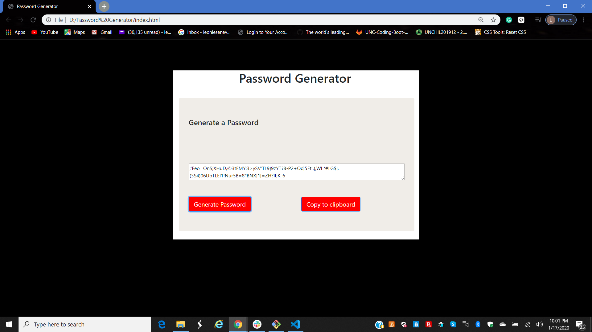

# Password-Generator
HW 3

This form allows you to generate random passwords. 
When the generate pwd btn is clicked it will prompt the user several options such as 
            Special characters,
            Numeric characters,
            Lowercase characters,
            Uppercase characters.
Then it will allow user to decide the length of password between 8-128 characters.
 
Finally it will appear a random Password accordingly to users request, in the text box of the form. The copy to clipboard btn will copy the new password to the clipboard too.

https://github.com/leoniesenevi/Password-Generator

https://leoniesenevi.github.io/Password-Generator/.

